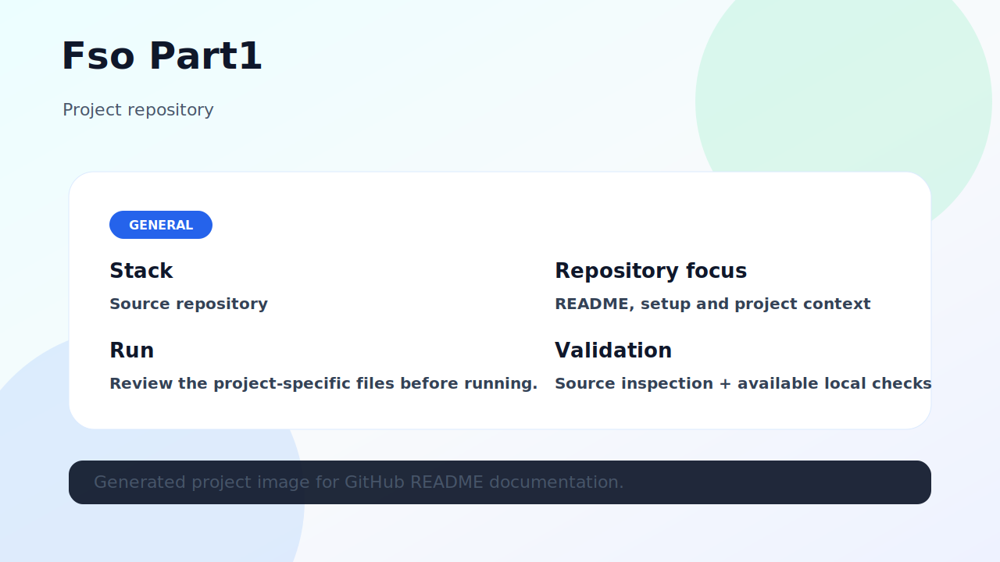

# Fso Part1

Project repository



## Stack

- Source repository

## What this repository contains

This repository contains the source code and documentation for **fso-part1**. The README was refreshed to make the project easier to understand, run and validate from GitHub.

## Project image

The image above represents the current project state. When a local browser runtime was available, it was captured from the running project; otherwise it is an honest architecture/overview image based on source inspection.

## Getting started

```bash
git clone https://github.com/luisMakesIt/fso-part1.git
cd fso-part1
```

### Install dependencies

```bash
No dependency installation detected.
```

### Run locally

```bash
Review the project-specific files before running.
```

## Available scripts / commands

| Command | Description |
| --- | --- |
| — | No package scripts detected |

## Validation notes

- Source inspection completed.

## Suggested next improvements

- Add automated tests or CI if the project does not have them yet.
- Keep environment-specific values out of version control.
- Document any external services required to run the project locally.
